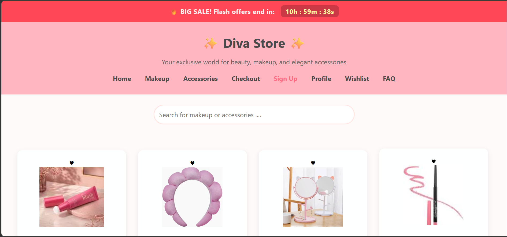
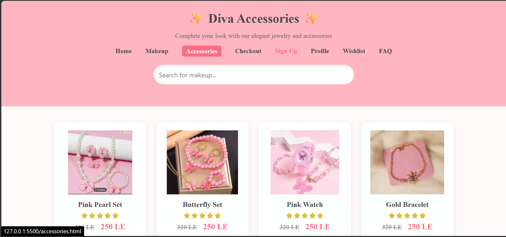
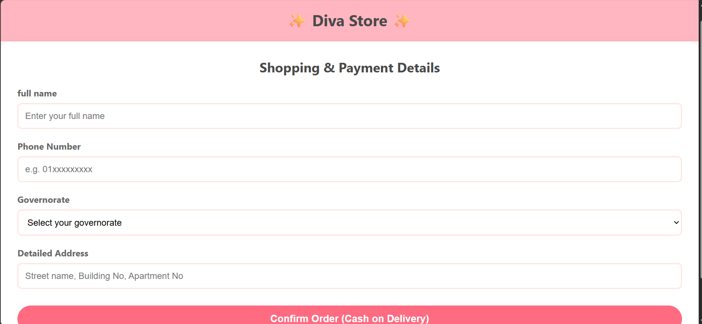
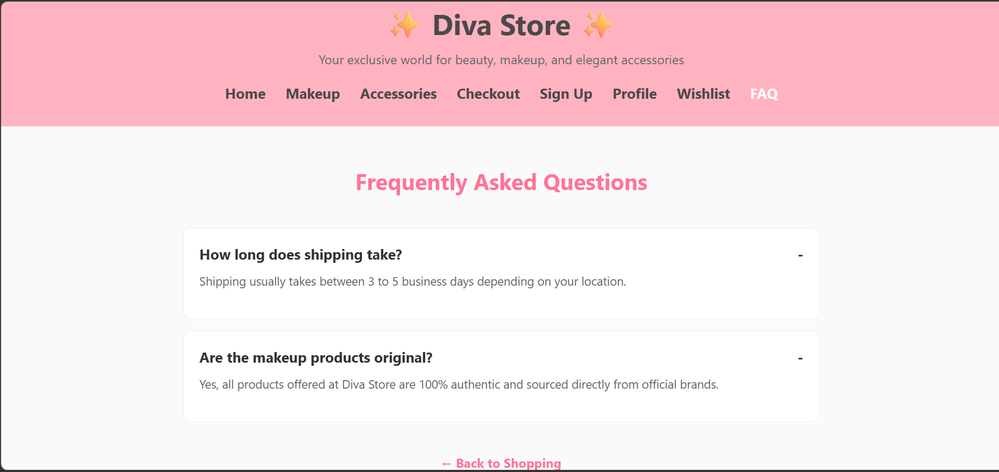
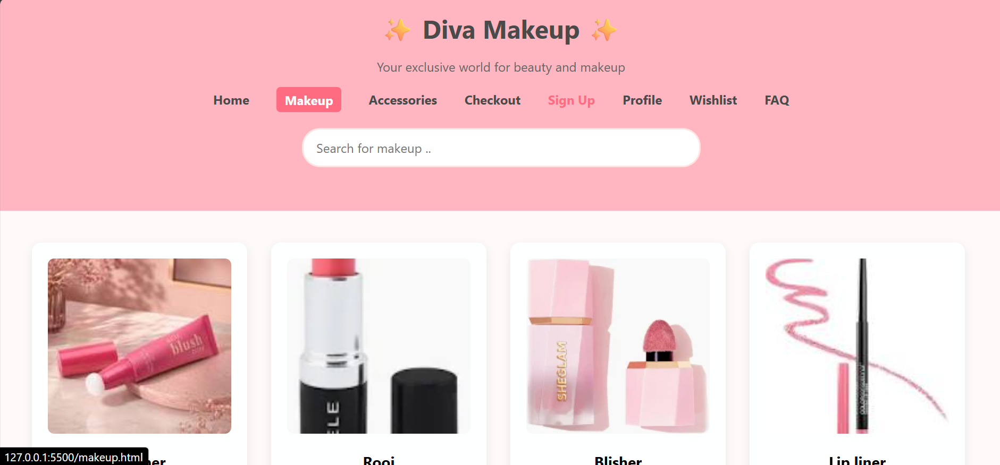
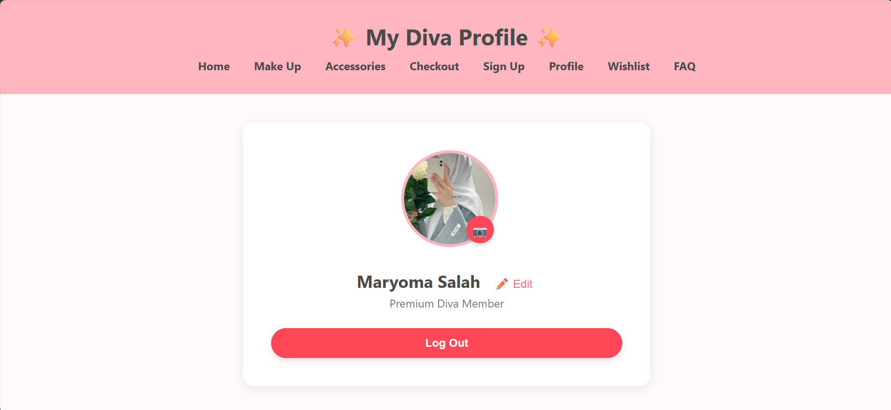
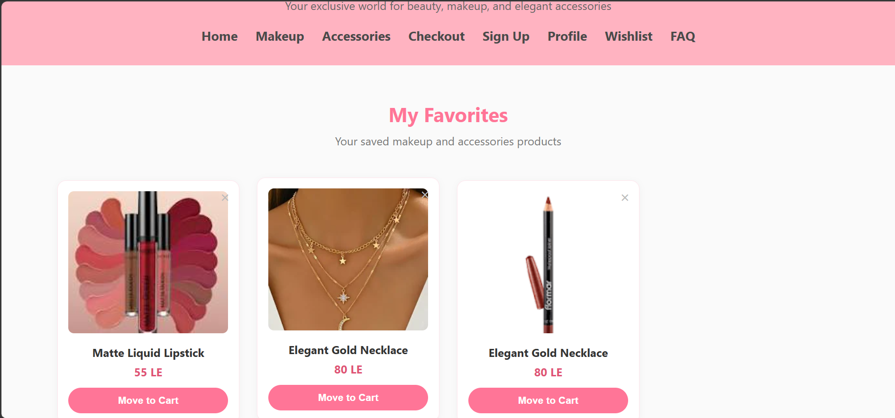

# Diva Store 💄

## What is Diva Store?
Diva Store is a modern and responsive e-commerce web application created for beauty products, stylish accessories, and personal care essentials. This online shop offers a smooth shopping experience for users looking for high-quality makeup, trendy jewelry, and daily grooming items.

## Why I Built This Project
 I created Diva Store as a software development student at Iva International School for Applied Technology. This project is part of my educational journey to practice building user-friendly interfaces, arranging semantic HTML components, and designing clean layouts that showcase cosmetics and accessories seamlessly across computer screens.
## How the Project Was Made (Tech Stack)
  The project was built from scratch using clean structural practices. The tech stack includes HTML5 for constructing the layout and semantic web elements, CSS3 for responsive styles and custom layouts, alongside JavaScript (JS) to add dynamic features and interactivity to the store.
## How To Run The Project Locally
"To look at the project files locally on your computer, follow these simple steps:
Clone the repository to your device: git clone https://github.com/MaryomaSalah/Diva-store.git
Open the main directory: cd Diva-store
Launch the web application: Open the index.html file inside your favorite web browser to preview the live design."

## AI Disclosure
As a software development student at Iva International School for Applied Technology, this entire project was very easy and straightforward for me, and I did not need to copy or cheat any part of the source code. AI was utilized only to assist me in choosing and selecting the color palettes for the CSS layout. All primary development, coding, and design layouts were made entirely by myself based on my academic studies.
 

